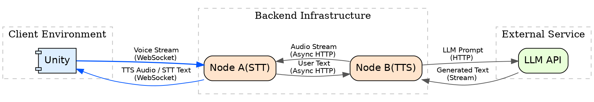

# 유니티 오디오 파이프 라인
---------
## 1. 전체 구조 개요
이 프로젝트는 VR 면접 시뮬레이터를 위한 저지연 음성 대화 파이프라인 프로토타입이다.
본 파이프라인은 세 개의 메인 구성 요소로 구성되어 있다.
Unity: 사용자의 마이크 입력을 받고 입력에 따른 LLM의 응답을 오디오로 출력한다.
Node A(stt-worker): 유니티와 웹 소켓으로 연결되어 오디오 입력을 STT 모델을 사용하여 텍스트로 변환한다. 
이후 변환된 텍스트를 Node B에 http POST 메소드로 전송한다.
Node B가 반환한 오디오는 그대로 유니티로 패스스루
Node B(tts-worker): Node A가 전사한 텍스트를 POST로 받아 LLM api로 전송,
api의 텍스트 응답을 TTS 모델을 이용해 오디오로 변환하여 스트리밍 방식으로 Node A로 전송한다.

* 마이크 입력 (Unity → Node A): 16kHz, Mono, 16-bit Int PCM (WAV Header on start)
* 음성 출력 (Node B → Unity): 48kHz, Mono, 32-bit Float PCM

## 2. 사용된 기술 설명
#### 2.1 docker
모델을 gpu 환경에서 가동하기 위한 cudnn, cuda같은 환경을 가상화하여 환경 설정으로 인한 문제를 줄이기 위해 사용
추가로 노드를 로컬이 아닌 별도의 기기에 구동시킬 경우의 확장성을 대비
#### 2.2 FastAPI
STT, TTS 모델을 가동하기 위한 Python 환경에서 사용할 웹 프레임워크
웹소켓이나 비동기 http POST 엔드포인트 모두 FastAPI를 사용하여 구현된다.
#### 2.3 FishSpeech v1.5(TTS)
다국어 지원 가능한 zero-shot TTS 모델
48kHz 음성 파일을 생성해냄, 10초 가량의 레퍼런스 오디오로 보이스 클로닝 가능
Pytorch 컴파일 + 4060ti 8gb 기준: rtf는 대략 5~10:1, 사용 vram은 3~4 GB정도 점유
#### 2.4  Silero VAD
경량 음성 활성 탐지 모델
단순 오디오 음량 탐지보다 더 정확하게 발화 종료를 탐지
사용자의 대답이 끝났는지 확인하는 딜레이를 줄이기 위해 사용
#### 2.5 Whisper large-v3 turbo model for CTranslate2(STT)
음성을 텍스트로 변환하는 STT모델
16kHz wav file을 입력으로 받음
4060ti 8gb 기준: rtf는 대략 10~15:1, 사용 vram은 2~3 GB정도 점유
#### 2.6 Groq API
테스트용 저지연 LLM API
모델마다 다르지만, 무료 티어에서도 분당 30, 하루 1k의 요청 가능

## 3. 스크립트 설명
#### 3.1 AudioUtils.cs
유니티의 AudioClip 관련된 함수를 위한 유틸리티 클래스
예로 AudioClip을 16Khz wav 파일 변환, 특정 구간 잘라내기 같은 함수를 포함
#### 3.2 FeatureData.cs
아직은 제대로 사용되지 않지만, 추후에 Feature 데이터를 담기 위한 DTO 클래스
#### 3.3 PipelineController.cs
전체 오디오 파이프라인 흐름을 제어하는 컨트롤러 클래스
각 오브젝트의 이벤트 관리를 담당하고 각 이벤트에 맞는 핸들러 함수가 정의되어 있다.
#### 3.4 Speaker.cs
Node B(TTS)에서 온 48kHz, Mono, 32-bit Float PCM 오디오 데이터를 유니티에서 재생하기 위한 클래스
#### 3.5 STTManager.cs
유니티와 Node A(STT)간의 웹소켓 송수신을 담당하는 클래스
#### 3.6 VoiceActivityDetector.cs
실제 사용자의 마이크 입력을 처리하고 그에 관련한 이벤트를 발생시키는 클래스
## 4. 실행 방법
#### 4.1 준비물
1. Docker
2. VS Code + devcontainer extension
3. .env 파일
#### 4.2 .env 파일 형식
1. stt-worker-docker 폴더내의 .env
TTS_WORKER_URL = http://host.docker.internal:8001/process(노드 B의 주소)
2. tts-worker-docker 폴더내의 .env
GROQ_API_KEY = groq api 키
MODEL_NAME = 사용할 모델 (예: openai/gpt-oss-20b)
SYSTEM_PROMPT = 시스템 프롬프트로 넣고 싶은 텍스트
#### 4.3 실행
1. 먼저 프로젝트 루트 폴더(verbal_process)를 VS Code로 오픈
2. terminal(powershell)에서 open_container.ps1 파일 실행 (그냥 두 노드 폴더를 루트로 다시 VS Code 실행시키는 역할)
3. 새로 열린 두 개의 워크스페이스(stt-worker-docker, tts-worker-docker)에서 Command palette의 Dev Containers: Reopen in Container 명령을 실행
4. docker 실행되면 python 파일(stt-worker.py ,tts-worker.py) 각각 실행
5. 유니티 실행
